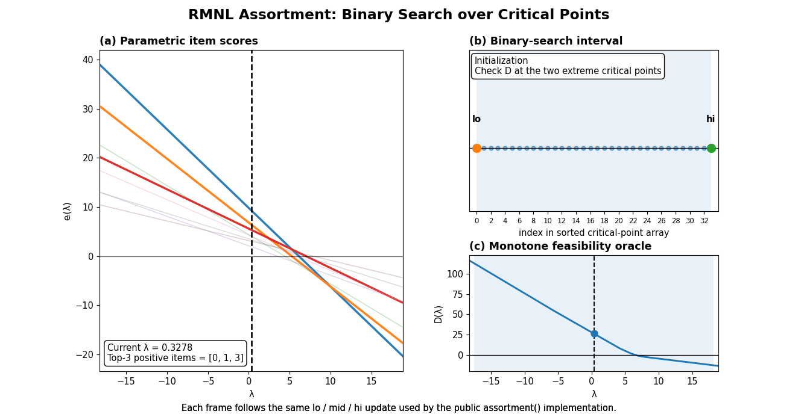

# RMNL Assortment 与动态缓存优化

[English](README.md) | **中文**

本仓库包含三个主要部分：精确 RMNL assortment 求解器、基于 PPO 的动态缓存决策实验，以及用于生成仿真请求数据的 synthetic-data generator。

## Assortment 优化

Assortment 求解器首先构造参数化 item-score 函数对应的有序 critical points，然后利用单调 oracle $D(\lambda)$ 的符号进行二分查找，从而定位包含最优解的区间。

<p align="center">
  
</p>

上面的动画由 `assortment.py` 中实际使用的二分查找逻辑生成。算法根据 $D(\lambda_{mid})$ 的符号不断更新 `lo`、`mid` 和 `hi`，直到最终确定两个相邻 critical points 构成的搜索区间。

## 仓库结构

```text
.
├── assortment.py
├── cache_rl.py
├── generate_simulation_data.py
├── runtime_params.example.json
├── requirements.txt
├── requirements-rl.txt
├── demo/
│   └── generate_binary_search_gif.py
└── assets/
    └── assortment_search.gif
```

其中：

- `assortment.py`：RMNL assortment 核心求解算法。
- `cache_rl.py`：基于 PPO 的动态缓存决策实验代码。
- `generate_simulation_data.py`：生成仿真请求、用户偏好和社交关系数据。
- `runtime_params.example.json`：运行时参数模板，不包含实验私有参数值。
- `demo/generate_binary_search_gif.py`：根据真实二分搜索过程生成 README 中的动画。
- `assets/assortment_search.gif`：README 使用的二分查找可视化结果。

## 安装依赖

如果只运行 assortment 求解器、生成 GIF 或生成仿真数据，可以安装基础依赖：

```bash
pip install -r requirements.txt
```

如果需要运行完整的 PPO 缓存实验：

```bash
pip install -r requirements-rl.txt
```

## 测试 Assortment 求解器

直接运行：

```bash
python assortment.py
```

脚本会执行一组确定性测试，并使用随机样例与 exhaustive search 的结果进行对比，以检查 assortment 求解结果是否正确。

## 重新生成二分查找动画

运行：

```bash
python demo/generate_binary_search_gif.py
```

生成的 GIF 会保存到：

```text
assets/assortment_search.gif
```

该动画直接记录 assortment 求解器的实际二分搜索轨迹，而不是对 $\lambda$ 进行连续扫描。

## 生成仿真数据

运行：

```bash
python generate_simulation_data.py --output-dir ./data
```

程序会生成：

```text
data/records.pkl
data/user_prefs.npy
data/social_graph.npy
```

其中，请求记录的格式为：

```text
(user_id, time_slot, item_id)
```

分别表示用户编号、时间片和请求的 item 编号。

## 配置运行时参数

首先复制公开参数模板：

```bash
cp runtime_params.example.json runtime_params.json
```

`runtime_params.json` 现在作为主要实验配置入口，可直接配置：

- 系统规模与容量：`U`、`I`、`T`、`K`、`C_cs`；
- 用户偏好更新与社交影响参数；
- item size 生成范围和随机种子；
- 收益、缓存更新和抖动成本参数；
- PPO 超参数与训练步数；
- 评估次数与随机种子；
- 请求数据、用户偏好和社交图文件路径。


## 运行缓存决策实验

当数据路径和实验参数都已经写入 JSON 后，最基本的运行方式是：

```bash
python cache_rl.py --runtime-config ./runtime_params.json
```

如果只想临时覆盖某几个 JSON 参数，也可以使用命令行，例如：

```bash
python cache_rl.py \
  --runtime-config ./runtime_params.json \
  --time-slots 200 \
  --data-path ./data/alternative_records.pkl
```

可通过以下命令查看支持的命令行覆盖项：

```bash
python cache_rl.py --help
```


## License

本项目采用 MIT License，详见 `LICENSE`。
